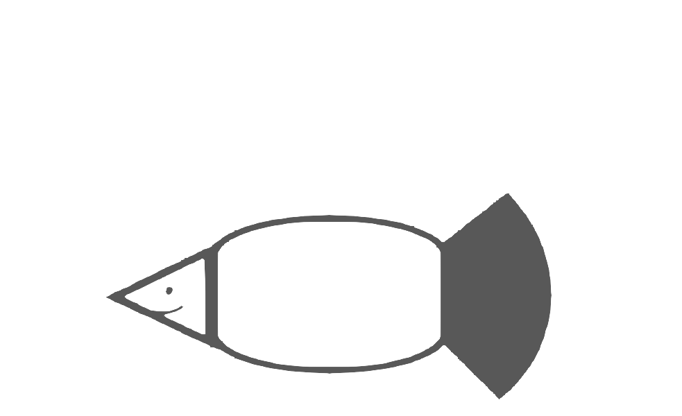

对不起骗了大家这么久，其实我是一条鲤鱼。

<pre id="output" style="color: transparent;" class="secret-text">
                                                                       
                                                                       
                                                             ..-*=.    
                            ......:::.......               .:=*****:.  
                        ..:=++*++=---------=++**+=:..    .:+********-. 
                ...+*+:..                   ..:=*+:.-***************-. 
                ..:-*+..                            .=***************: 
            .:=+*=**:                              .:***************+. 
        ..-=-     +*:                              .:****************: 
    ..:+          +*:                              .:****************- 
    .+*    **      +*:                              .:****************-
    .-**          +*:                              .:****************: 
        +...+     +*:                              .:****************. 
            :.:=****-.                             .:***************-  
                ..:-++-..                       ..-++-*************=.  
                    ..:=**+=:.....     .....:-+**+:....-**********=..  
                        ...:-===++++++==-:...           .-*******=.    
                                                          ..=***+.     
                                                           ..-*:.      
                                                                       
                                                                       
</pre>

嗯，实在是太敷衍了，所以我稍微加了点东西。

祝你好运，也祝你玩得开心。

<!-- 烛言加的东西 -->

    黄昏的树林里分出两条路，
    所幸在此我能同时去涉足

    <a href="many-people-path.html" class="path path-visible">
        人来人往的路
    </a>
    <a href="jurora-path.html" class="path path-hidden">
        人迹罕至的路
    </a>

    或许哪天还会再来看看这里的变化？启程了，再见啦。

